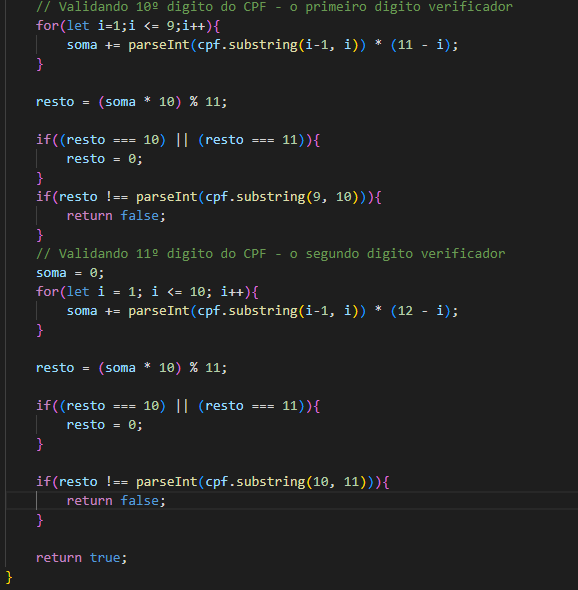
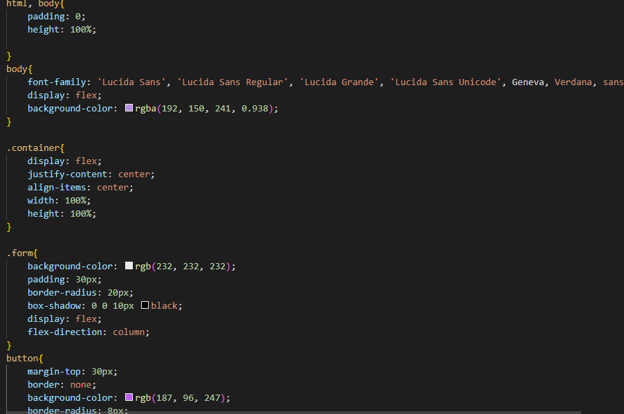
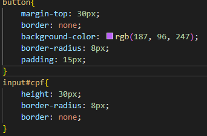
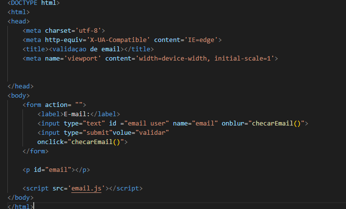
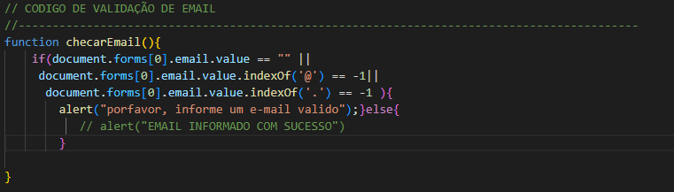

# PROJETOS COM VALIDAÇÕES

## VALIDAÇÃO DE CPF 

 Códigos:
  
 - HTML:  

 

 - JS:  
 

 

 - CSS:  
 

 
  
### EXPLICAÇÃO JS

  A validação foi feita dígito por dígito usando o laço de iteração e repetição "for" para compor um array para cada dígito. Também foi usado "if else" para a confirmação da soma no código.

## VALIDAÇÃO DE EMAIL

  Códigos:
  
 - HTML:  
      

 - JS:  
 
    

### EXPLICAÇÃO JS

   Foi usado "if else" para a validação. Se o email informado não tiver '@' e '.com', a tela de alert aparece com a seguinte mensagem "por favor, informe um email válido" pois o email não será válido. Caso o email for válido a tela de alert aparece "email informado com sucesso".

 

